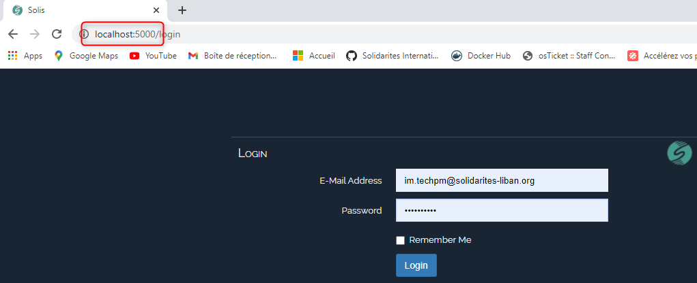
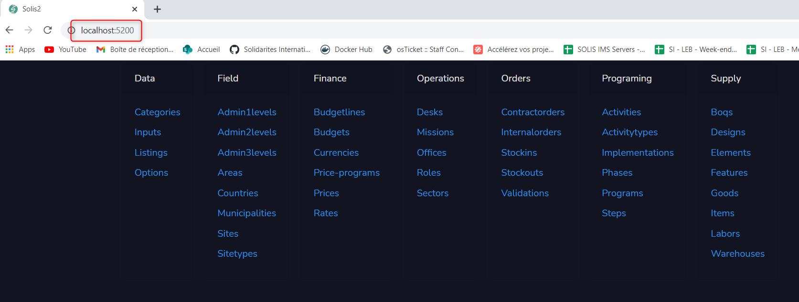

# SOLIS

## Introduction

This document explains how to use the SOLIS application when working at the office or remotely.
When working at the office, to have the most efficient connection, you can access the SOLIS application through the server's **local IP address**, but when working remotely, you will need to connect to the server through a **ssh connection** a **relay server**.

Currently, we have 6 SOLIS servers on the mission:

| Server name | Location | Local IP address |
| ----------- | -------- | ---------------- |
| solis1      | Miniyeh  | 192.168.88.39    |
| solis2      | Beirut   | 192.168.88.192   |
| solis3      | Beirut   | 192.168.88.193   |
| solis4      | Zahle    | 10.0.2.78        |
| solis5      | Miniyeh  | 192.168.88.40    |
| solis6      | Zahle    | 10.0.2.87        |

## At the office

When working at the office, and connected to the office Wifi, you can access the SOLIS application directly by typing in the **local IP address** of the server in any web browser, followed by **:8000**.
For example, if you are at the Miniyeh office, you can connect to **solis1** by opening any web browser and entering the URL **192.168.88.39:8000**.


And you will get redirected to the SOLIS login page.

You can also access a demo version of the Solis 2 application by replacing the port **:8000** by **:8001**.


## Remotely

In order to access the SOLIS application remotely, for security reasons, you need to gain access rights to the servers, and you will need to set a few things up on your computer before.

### Initial setup (to be done only once)

To access the server remotely, you will need to connect to a relay server through a **ssh connection**, and for that, you will first need to generate a **ssh private / public key pair**.
Please follow the below steps:

1. Download and install Git Bash for Windows from the following link : <https://gitforwindows.org/>
2. Open Git Bash, and run the following command in the terminal to generate your **ssh private / public key pair** (replace the `name` by your first name, last name or windows login):

   `ssh-keygen -t ed25519 -C "name" -f $HOME/.ssh/name`

   You can provide a passphrase for your ssh key file, or leave it empty.

   

This will create 2 files in the folder `C:\Users\user_name\.ssh\` (`user_name` is your windows login):

- _name_ : this is your **ssh private key**
- _name.pub_ : this is your **ssh public key**
  (_name_ is the name you provided in the previous step)


Once you have succesfully generated these files, please contact the IM team and send them your **ssh public key** and the _name_ you chose, and we will provide remote access to the servers.
We will send you a **ssh config file** named _config_, that you will need to add to the same folder (`C:\Users\user_name\.ssh\`). An example of this file is provided at the end of this document.
This will allow you to access the SOLIS application with a single command!

### Connect to the server

When working from home, you will access the SOLIS application through a **ssh connection**. Please follow the below steps everytime you want to access the application:

1. Open Git Bash and run one of the following commands in the terminal, depending on which server you want to connect to

   `ssh -N solis1`

   `ssh -N solis2`

   `ssh -N solis3`

   `ssh -N solis4`

   `ssh -N solis5`

   `ssh -N solis6`

   If you have provided a passphrase for your **ssh private key** in the initial setup, you will need to provide this passphrase.

   

2. Open any web browser and access the SOLIS application with the following URL:

   `localhost:5200`

   And you will get redirected to the SOLIS login page.

   

3. You can also access a demo version of the Solis 2 application with the following URL:

   `localhost:5400`

   

## Configuration file

Below is the **ssh config file**. The **$name** fields will be replaced by the name you provided in the initial setup.

You can download the file with the following link: [config](config)

```
Host *
    StrictHostKeyChecking no
    UserKnownHostsFile /dev/null
    ServerAliveInterval 240

# Solis Servers
Host solis1
    HostName relay0.solis-demo.org
    User $name
    IdentityFile ~/.ssh/$name
    LocalForward 5000 localhost:5001
    LocalForward 5100 localhost:5101
    LocalForward 5200 localhost:5201
    LocalForward 5300 localhost:5301
    LocalForward 5400 localhost:5401
    LocalForward 5500 localhost:5501

Host solis2
    HostName relay0.solis-demo.org
    User $name
    IdentityFile ~/.ssh/$name
    LocalForward 5000 localhost:5002
    LocalForward 5100 localhost:5102
    LocalForward 5200 localhost:5202
    LocalForward 5300 localhost:5302
    LocalForward 5400 localhost:5402
    LocalForward 5500 localhost:5502

Host solis3
    HostName relay0.solis-demo.org
    User $name
    IdentityFile ~/.ssh/$name
    LocalForward 5000 localhost:5003
    LocalForward 5100 localhost:5103
    LocalForward 5200 localhost:5203
    LocalForward 5300 localhost:5303
    LocalForward 5400 localhost:5403
    LocalForward 5500 localhost:5503

Host solis4
    HostName relay0.solis-demo.org
    User $name
    IdentityFile ~/.ssh/$name
    LocalForward 5000 localhost:5004
    LocalForward 5100 localhost:5104
    LocalForward 5200 localhost:5204
    LocalForward 5300 localhost:5304
    LocalForward 5400 localhost:5404
    LocalForward 5500 localhost:5504

Host solis5
    HostName relay0.solis-demo.org
    User $name
    IdentityFile ~/.ssh/$name
    LocalForward 5000 localhost:5005
    LocalForward 5100 localhost:5105
    LocalForward 5200 localhost:5205
    LocalForward 5300 localhost:5305
    LocalForward 5400 localhost:5405
    LocalForward 5500 localhost:5505

Host solis6
    HostName relay0.solis-demo.org
    User $name
    IdentityFile ~/.ssh/$name
    LocalForward 5000 localhost:5006
    LocalForward 5100 localhost:5106
    LocalForward 5200 localhost:5206
    LocalForward 5300 localhost:5306
    LocalForward 5400 localhost:5406
    LocalForward 5500 localhost:5506
```
